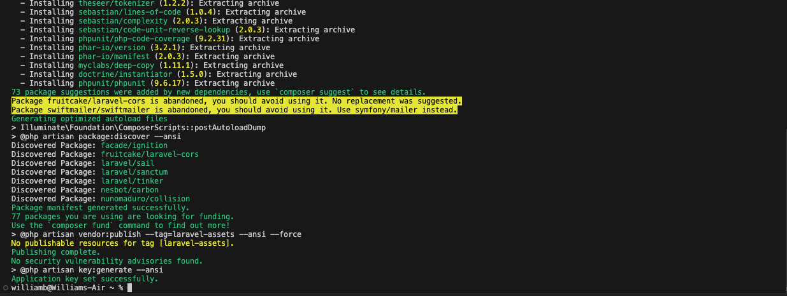

   

  <h2 align="center">HishaU-Movie-App-U05</h2>
  
   HTML, CSS, JavaScript, Php, Mysql och Laravel 8.

  <a href="#"><strong>➥ Live Demo</strong></a>

## U0-5 Movie Web-application (HishaU)

U0-5 Movie Web-application handlar en komplett dynamisk webbplats HishaU, efter egen design, med PHP med Laravel, API, JavaScript, HTML och CSS för att fördjupa era kunskaper inom webbutveckling.

U0-5 Innehåller 

- En webbplats skriven med PHP för backend, JS (om ni vill), HTML och CSS för front-end samt en databas i SQL, API 

- Ska använda sig av PHP-ramverket Laravel

- En SQL-databas med tabeller och data som är skapade via Laravel migrations

- Webbplatsen ska ha tre olika typer av åtkomster (tänk RBAC, role-based access control)

- En publik del ska kunna besökas utan inloggning för vanliga besökare

- En inloggad del som då kräver registrering där man som användare:

- Ska kunna recensera filmer

- Se, skapa och ändra i listor med filmer som man vill se (se IMDb:s watchlist)

- En skyddad del, där endast en administratör kan logga in för att göra följande:

- Hantera recensioner och kommentarer (godkänna, ta bort)

- CRUD-operationer för filmer

- CRUD-operationer för användare

</a>

## Colors

    --primary-color:#22254b;
    --secondary-color:  hsl(202, 86%, 8%); 
    --white: hsl(0, 100%, 100%);
    --citrine: hsla(0, 100%, 41%, 0.918);
    --rich-black-fogra-29: hsl(225, 25%, 9%);
    --rich-black-fogra-39: hsl(170, 21%, 5%);
    --raisin-black: hsl(228, 13%, 15%);
    --eerie-black: hsl(207, 19%, 11%);
    --light-gray: hsl(0, 3%, 80%);
    --gunmetal-1: hsl(229, 15%, 21%);
    --gunmetal-2: hsl(216, 22%, 18%);
    --gainsboro: hsl(0, 7%, 88%);
    --xiketic: hsl(253, 21%, 13%);
    --gray-x: hsl(0, 0%, 74%);
    --black: hsl(0, 0%, 0%);
    --jet: hsl(0, 0%, 20%);

## Typographi 

    --ff-poppins: "Poppins", sans-serif;
    --fs-1: 36px;
    --fs-2: 32px;
    --fs-3: 30px;
    --fs-4: 24px;
    --fs-5: 20px;
    --fs-6: 18px;
    --fs-7: 16px;
    --fs-8: 15px;
    --fs-9: 14px;
    --fs-10: 13px;
    --fs-11: 12px;
    --fs-12: 11px;
    --fw-500: 500;
    --fw-700: 700;
