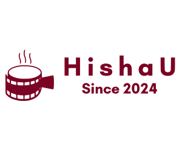

   

  <h2 align="center">HishaU-Movie-App-U05</h2>

  HishaU-Movie-App-U05 är en helt responsiv filmwebbsida,  Responsiv för alla enheter, byggd med HTML, CSS, JavaScript, Php, Mysql och Laravel 8.

  <a href="https://codewithsadee.github.io/filmlane/"><strong>➥ Live Demo</strong></a>

## U0-5 Movie Web-application (HishaU)

U0-5 Movie Web-application handlar en komplett dynamisk webbplats HishaU, efter egen design, med PHP med Laravel, API, JavaScript, HTML och CSS för att fördjupa era kunskaper inom webbutveckling.

U0-5 Innehåller 

- En webbplats skriven med PHP för backend, JS (om ni vill), HTML och CSS för front-end samt en databas i SQL, API 

- Ska använda sig av PHP-ramverket Laravel

- En SQL-databas med tabeller och data som är skapade via Laravel migrations

- Webbplatsen ska ha tre olika typer av åtkomster (tänk RBAC, role-based access control)

- En publik del ska kunna besökas utan inloggning för vanliga besökare

- En inloggad del som då kräver registrering där man som användare:

- Ska kunna recensera filmer

- Se, skapa och ändra i listor med filmer som man vill se (se IMDb:s watchlist)

- En skyddad del, där endast en administratör kan logga in för att göra följande:

- Hantera recensioner och kommentarer (godkänna, ta bort)

- CRUD-operationer för filmer

- CRUD-operationer för användare